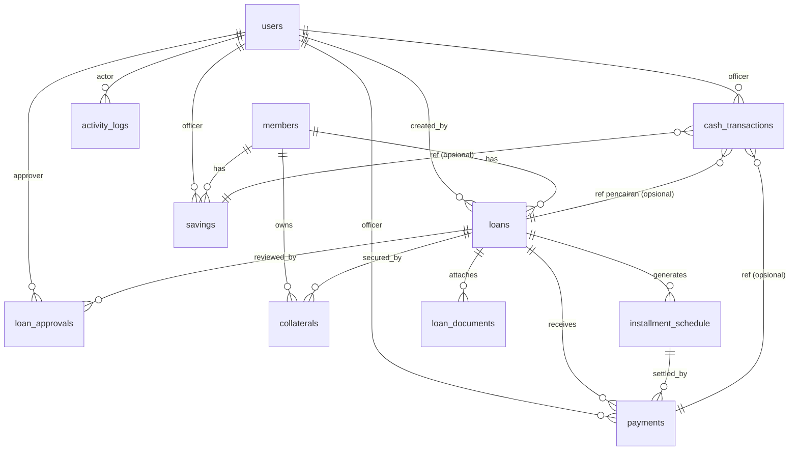

# Arsitektur Sistem Koperasi Simpan Pinjam

Dokumen acuan pengembangan penuh (11 modul). Tech stack: **FastAPI + SQLite +
Vue 3 (Vite)**, full lokal & portabel. Server produksi tunggal di
`http://127.0.0.1:8001` (lihat `run.py`).

Prinsip desain yang dipertahankan dari boilerplate:
- **Uang disimpan sebagai INTEGER Rupiah** (tanpa sen) → bebas galat pembulatan float.
- **Tanggal disimpan TEXT ISO-8601** (`YYYY-MM-DD` / `YYYY-MM-DD HH:MM:SS`).
- **Path file relatif** terhadap root project → tetap portabel saat folder dipindah.
- File upload (KTP, jaminan, dokumen) disimpan di `uploads/` (path-nya, bukan blob, masuk DB).

---

## 1. Skema Database (SQLite)

### 1.1 Diagram Relasi (ERD)



### 1.2 Tabel & Tipe Data

> Catatan: `users` = akun operator/petugas (untuk login & audit).
> `members` = anggota koperasi (data master). Sengaja dipisah.

#### `users` — akun login petugas/admin
| Kolom | Tipe | Ket |
|-------|------|-----|
| id | INTEGER PK AUTOINCREMENT | |
| username | TEXT UNIQUE NOT NULL | |
| password_hash | TEXT NOT NULL | hash (bcrypt/argon2) |
| full_name | TEXT NOT NULL | |
| role | TEXT NOT NULL | `admin` / `petugas` |
| is_active | INTEGER NOT NULL DEFAULT 1 | boolean 0/1 |
| created_at | TEXT NOT NULL | ISO datetime |

#### `members` — data anggota (Modul 2)
| Kolom | Tipe | Ket |
|-------|------|-----|
| id | INTEGER PK | |
| member_number | TEXT UNIQUE NOT NULL | no anggota (auto, mis. `AGT-2026-0001`) |
| full_name | TEXT NOT NULL | |
| nik | TEXT UNIQUE | no KTP |
| ktp_photo_path | TEXT | path file di `uploads/ktp/` |
| address | TEXT | |
| phone | TEXT | utk share WhatsApp |
| email | TEXT | |
| join_date | TEXT | |
| status | TEXT NOT NULL DEFAULT 'aktif' | `aktif` / `nonaktif` |
| created_at | TEXT NOT NULL | |
| updated_at | TEXT | |

#### `loans` — pengajuan + siklus hidup pinjaman (Modul 3 & 6)
| Kolom | Tipe | Ket |
|-------|------|-----|
| id | INTEGER PK | |
| loan_number | TEXT UNIQUE NOT NULL | auto `PJM-2026-0001` |
| **member_id** | INTEGER NOT NULL | **FK → members.id** |
| principal_amount | INTEGER NOT NULL | nominal pinjaman (Rp) |
| interest_rate | REAL NOT NULL | bunga % per bulan |
| interest_type | TEXT NOT NULL DEFAULT 'flat' | `flat` / `menurun` |
| tenor | INTEGER NOT NULL | bulan |
| admin_pct | REAL DEFAULT 0 | |
| provisi_pct | REAL DEFAULT 0 | |
| form_fee | INTEGER DEFAULT 0 | biaya form & pemeriksaan |
| admin_fee | INTEGER DEFAULT 0 | nominal hasil hitung |
| provisi_fee | INTEGER DEFAULT 0 | nominal hasil hitung |
| total_fees | INTEGER DEFAULT 0 | total potongan awal |
| net_received | INTEGER DEFAULT 0 | dana bersih diterima |
| total_payable | INTEGER DEFAULT 0 | total yang harus dibayar |
| disbursement_date | TEXT | tanggal pencairan |
| purpose | TEXT | keperluan |
| status | TEXT NOT NULL DEFAULT 'draft' | `draft`/`pending`/`approved`/`rejected`/`active`/`paid_off` |
| **created_by** | INTEGER | **FK → users.id** |
| created_at | TEXT NOT NULL | |
| updated_at | TEXT | |

#### `loan_approvals` — persetujuan kredit (Modul 5)
| Kolom | Tipe | Ket |
|-------|------|-----|
| id | INTEGER PK | |
| **loan_id** | INTEGER NOT NULL | **FK → loans.id** |
| **approver_id** | INTEGER NOT NULL | **FK → users.id** |
| decision | TEXT NOT NULL | `approve` / `reject` |
| note | TEXT | catatan approval |
| decided_at | TEXT NOT NULL | |

#### `loan_documents` — upload dokumen pengajuan (Modul 3)
| Kolom | Tipe | Ket |
|-------|------|-----|
| id | INTEGER PK | |
| **loan_id** | INTEGER NOT NULL | **FK → loans.id** |
| doc_type | TEXT | mis. `slip_gaji`, `kk` |
| file_path | TEXT NOT NULL | `uploads/loan_docs/...` |
| uploaded_at | TEXT NOT NULL | |

#### `collaterals` — jaminan (Modul 2 & 3)
| Kolom | Tipe | Ket |
|-------|------|-----|
| id | INTEGER PK | |
| **member_id** | INTEGER | **FK → members.id** |
| **loan_id** | INTEGER | **FK → loans.id** (nullable) |
| type | TEXT | BPKB/Sertifikat/dll |
| description | TEXT | |
| estimated_value | INTEGER | taksiran (Rp) |
| document_path | TEXT | foto/scan jaminan |

#### `installment_schedule` — jadwal/rincian angsuran (Modul 6 & 7)
| Kolom | Tipe | Ket |
|-------|------|-----|
| id | INTEGER PK | |
| **loan_id** | INTEGER NOT NULL | **FK → loans.id** |
| installment_no | INTEGER NOT NULL | bulan ke- |
| due_date | TEXT NOT NULL | jatuh tempo (utk reminder) |
| principal_due | INTEGER NOT NULL | porsi pokok |
| interest_due | INTEGER NOT NULL | porsi bunga |
| total_due | INTEGER NOT NULL | total angsuran bulan itu |
| paid_amount | INTEGER DEFAULT 0 | |
| paid_date | TEXT | |
| status | TEXT NOT NULL DEFAULT 'unpaid' | `unpaid`/`partial`/`paid` |

#### `payments` — pembayaran angsuran + kwitansi (Modul 7)
| Kolom | Tipe | Ket |
|-------|------|-----|
| id | INTEGER PK | |
| payment_number | TEXT UNIQUE NOT NULL | no kwitansi auto `KWT-2026-0001` |
| **loan_id** | INTEGER NOT NULL | **FK → loans.id** |
| **member_id** | INTEGER NOT NULL | **FK → members.id** |
| **schedule_id** | INTEGER | **FK → installment_schedule.id** (nullable) |
| payment_date | TEXT NOT NULL | |
| amount_paid | INTEGER NOT NULL | nominal bayar |
| principal_component | INTEGER DEFAULT 0 | hitung otomatis |
| interest_component | INTEGER DEFAULT 0 | hitung otomatis |
| penalty_component | INTEGER DEFAULT 0 | denda |
| payment_method | TEXT | `tunai`/`transfer` |
| remaining_balance | INTEGER | sisa pinjaman setelah bayar |
| **officer_id** | INTEGER | **FK → users.id** (TTD petugas) |
| note | TEXT | |
| created_at | TEXT NOT NULL | |

#### `savings` — transaksi simpanan 3 jenis (Modul 8)
| Kolom | Tipe | Ket |
|-------|------|-----|
| id | INTEGER PK | |
| **member_id** | INTEGER NOT NULL | **FK → members.id** |
| savings_type | TEXT NOT NULL | `pokok`/`wajib`/`sukarela` |
| transaction_type | TEXT NOT NULL | `setor`/`tarik` |
| amount | INTEGER NOT NULL | |
| balance_after | INTEGER NOT NULL | saldo berjalan |
| transaction_date | TEXT NOT NULL | |
| note | TEXT | |
| **officer_id** | INTEGER | **FK → users.id** |
| created_at | TEXT NOT NULL | |

#### `cash_transactions` — kas masuk/keluar & jurnal (Modul 9)
| Kolom | Tipe | Ket |
|-------|------|-----|
| id | INTEGER PK | |
| transaction_date | TEXT NOT NULL | |
| direction | TEXT NOT NULL | `in` / `out` |
| category | TEXT | `angsuran`/`pencairan`/`simpanan`/`operasional`/... |
| amount | INTEGER NOT NULL | |
| balance_after | INTEGER NOT NULL | saldo kas berjalan |
| description | TEXT | |
| ref_type | TEXT | `payment`/`savings`/`loan`/`manual` |
| ref_id | INTEGER | id transaksi sumber (relasi lunak) |
| **officer_id** | INTEGER | **FK → users.id** |
| created_at | TEXT NOT NULL | |

#### `settings` — pengaturan (key-value) (Modul 11)
| Kolom | Tipe | Ket |
|-------|------|-----|
| key | TEXT PK | mis. `coop_logo`, `printer_size`, `receipt_template` |
| value | TEXT | |

#### `number_sequences` — format nomor otomatis (Modul 11)
| Kolom | Tipe | Ket |
|-------|------|-----|
| name | TEXT PK | `member`/`loan`/`payment` |
| prefix | TEXT | `AGT`/`PJM`/`KWT` |
| current_value | INTEGER NOT NULL DEFAULT 0 | counter |
| reset_period | TEXT | `yearly`/`never` |

#### `activity_logs` — aktivitas terbaru dashboard (Modul 1)
| Kolom | Tipe | Ket |
|-------|------|-----|
| id | INTEGER PK | |
| **user_id** | INTEGER | **FK → users.id** |
| action | TEXT | `create_member`/`payment`/... |
| entity_type | TEXT | |
| entity_id | INTEGER | |
| description | TEXT | |
| created_at | TEXT NOT NULL | |

> **Catatan SHU & Dashboard:** angka dashboard (total pinjaman aktif, tunggakan,
> saldo kas, grafik) dan **SHU** dihitung *on-the-fly* lewat query agregasi —
> tidak perlu tabel khusus. Bila SHU per tahun ingin diarsipkan, tambah tabel
> `shu_distributions` di fase akhir.

### 1.3 Ringkasan Foreign Key
- `loans.member_id → members.id`
- `loans.created_by → users.id`
- `loan_approvals.loan_id → loans.id`, `loan_approvals.approver_id → users.id`
- `loan_documents.loan_id → loans.id`
- `collaterals.member_id → members.id`, `collaterals.loan_id → loans.id`
- `installment_schedule.loan_id → loans.id`
- `payments.loan_id → loans.id`, `payments.member_id → members.id`, `payments.schedule_id → installment_schedule.id`, `payments.officer_id → users.id`
- `savings.member_id → members.id`, `savings.officer_id → users.id`
- `cash_transactions.officer_id → users.id` (+ relasi lunak `ref_type/ref_id`)
- `activity_logs.user_id → users.id`

> Aktifkan `PRAGMA foreign_keys = ON;` di SQLite (SQLAlchemy: via event listener) agar FK ditegakkan.

---

## 2. Struktur Router & API (FastAPI)

Semua di bawah prefix `/api`. Pisahkan per modul menjadi `APIRouter` di
`backend/routers/`, lalu di-`include_router` di `main.py`.

```
backend/
├── main.py                 # include semua router + StaticFiles(frontend/dist)
├── database.py             # engine/session (sudah ada)
├── models.py               # semua model SQLAlchemy
├── schemas/                # Pydantic per modul
├── services/               # logika bisnis (kalkulasi, generate jadwal, nomor)
│   ├── calculations.py     # (sudah ada) simulasi bunga flat & menurun
│   ├── schedule.py         # generate installment_schedule saat pencairan
│   ├── numbering.py        # ambil nomor berikutnya dari number_sequences
│   └── reports.py          # query agregasi laporan & dashboard
└── routers/
    ├── auth.py
    ├── dashboard.py
    ├── members.py
    ├── loans.py
    ├── simulations.py
    ├── payments.py
    ├── savings.py
    ├── cash.py
    ├── reports.py
    └── settings.py
```

### Endpoint utama per modul

**Auth**
- `POST /api/auth/login` · `POST /api/auth/logout` · `GET /api/auth/me`

**Dashboard (Modul 1)**
- `GET /api/dashboard/summary` — semua widget (total anggota, pinjaman aktif, simpanan, pencairan bln ini, angsuran masuk, tunggakan, saldo kas)
- `GET /api/dashboard/chart?range=monthly` — data grafik transaksi
- `GET /api/dashboard/activities?limit=10` — aktivitas terbaru
- `GET /api/dashboard/reminders` — angsuran jatuh tempo

**Members (Modul 2)**
- `GET /api/members` (search, filter, paginate) · `POST /api/members` · `GET /api/members/{id}` · `PUT /api/members/{id}` · `DELETE /api/members/{id}`
- `POST /api/members/{id}/ktp` — upload KTP
- `GET /api/members/{id}/loans` · `GET /api/members/{id}/payments` — riwayat
- `GET /api/members/export?format=excel|pdf`

**Loans / Pengajuan (Modul 3 & 6)**
- `GET /api/loans` (filter status, search) · `POST /api/loans` (buat pengajuan/draft) · `GET /api/loans/{id}` · `PUT /api/loans/{id}`
- `POST /api/loans/{id}/documents` — upload dokumen
- `POST /api/loans/{id}/submit` — draft → pending
- `GET /api/loans/{id}/schedule` — jadwal angsuran
- `GET /api/loans/{id}/print?doc=pengajuan|kontrak&format=pdf`

**Simulations (Modul 4)**
- `POST /api/simulate` *(sudah ada)* — perluas: dukung `interest_type=flat|menurun`, denda opsional; output cicilan/bln, total bunga, total bayar, potongan awal, dana bersih, tabel angsuran
- `POST /api/simulate/pdf` — render PDF simulasi

**Approval (Modul 5)**
- `POST /api/loans/{id}/approve` (body: note) · `POST /api/loans/{id}/reject` (body: note)
- `POST /api/loans/{id}/disburse` — pencairan: set `active`, generate `installment_schedule`, catat `cash_transactions` (out)
- `GET /api/loans/{id}/print?doc=persetujuan`

**Payments (Modul 7)**
- `POST /api/payments` — input bayar; backend hitung pokok/bunga/denda + sisa, update schedule & status loan, catat kas (in)
- `GET /api/payments` (filter) · `GET /api/payments/{id}`
- `GET /api/payments/{id}/receipt?format=thermal58|a4|pdf` — kwitansi
- `GET /api/payments/{id}/whatsapp` — teks/link wa.me

**Savings (Modul 8)**
- `GET /api/savings?member_id=&type=` · `POST /api/savings` (setor/tarik)
- `GET /api/savings/balance?member_id=` — saldo per jenis
- `GET /api/savings/mutasi?member_id=&format=pdf`

**Cash & Keuangan (Modul 9)**
- `GET /api/cash` (filter tanggal) · `POST /api/cash` (kas masuk/keluar manual)
- `GET /api/cash/journal` · `GET /api/cash/daily-recap?date=`
- `GET /api/cash/export?format=pdf`

**Reports (Modul 10)**
- `GET /api/reports/{type}?period=harian|bulanan|tahunan&start=&end=` dengan `type` ∈ `loans|payments|savings|arrears|shu|cash`
- `GET /api/reports/{type}/export?format=pdf|excel`

**Settings (Modul 11)**
- `GET /api/settings` · `PUT /api/settings`
- `POST /api/settings/logo` — upload logo
- `GET /api/settings/backup` — unduh `koperasi.db` (backup) · `POST /api/settings/restore`

> **PDF/Excel/Print:** generate PDF di backend (mis. `weasyprint`/`reportlab`)
> ATAU cetak via browser (`window.print()` + CSS `@media print` utk thermal 58mm).
> Excel via `openpyxl`. WhatsApp = bangun URL `https://wa.me/<phone>?text=...`
> (tanpa API berbayar, cocok untuk app lokal).

---

## 3. Struktur Folder Frontend (Vue.js)

Tambahan dependency: `vue-router`, `pinia`, `axios`, `chart.js` + `vue-chartjs`,
`xlsx` (export Excel sisi klien, opsional). PDF & cetak via `window.print()`.

```
frontend/src/
├── main.js                 # daftarkan router + pinia
├── App.vue                 # <RouterView> di dalam layout
├── router/
│   └── index.js            # definisi semua route per modul
├── stores/                 # Pinia
│   ├── auth.js
│   ├── settings.js         # logo, printer, format nomor
│   └── ui.js               # state global (loading, toast)
├── api/
│   └── client.js           # instance axios (baseURL '/api') + interceptor
│
├── composables/            # logika reusable
│   ├── useCurrency.js      # format Rupiah
│   ├── useDateFilter.js    # filter harian/bulanan/tahunan
│   ├── usePrint.js         # cetak thermal/A4
│   └── useExport.js        # export Excel/PDF, share WhatsApp
│
├── layouts/
│   └── DefaultLayout.vue   # sidebar + topbar + <slot>
│
├── components/             # komponen UI reusable (dipakai banyak view)
│   ├── ui/
│   │   ├── BaseTable.vue       # tabel + sort + paginate
│   │   ├── BaseModal.vue
│   │   ├── BaseCard.vue
│   │   ├── SearchBar.vue
│   │   ├── DateRangeFilter.vue
│   │   ├── StatusBadge.vue
│   │   └── ConfirmDialog.vue
│   ├── global/             # tombol global (Print/PDF/Excel/WA)
│   │   ├── ActionToolbar.vue   # gabungan Print+PDF+Excel+Share
│   │   ├── PrintButton.vue
│   │   ├── ExportButtons.vue
│   │   └── WhatsappShare.vue
│   ├── dashboard/
│   │   ├── StatWidget.vue
│   │   ├── TransactionChart.vue
│   │   ├── RecentActivity.vue
│   │   ├── DueReminder.vue
│   │   └── QuickActions.vue
│   ├── members/
│   │   ├── MemberForm.vue
│   │   ├── KtpUpload.vue
│   │   └── MemberHistory.vue
│   ├── loans/
│   │   ├── LoanForm.vue
│   │   ├── DocumentUpload.vue
│   │   ├── ScheduleTable.vue
│   │   └── ApprovalPanel.vue
│   ├── simulation/
│   │   └── CreditSimulation.vue   # (sudah ada) → pindah ke sini
│   ├── payments/
│   │   ├── PaymentForm.vue
│   │   └── ReceiptTemplate.vue    # layout kwitansi (thermal/A4)
│   └── savings/
│       └── SavingsForm.vue
│
└── views/                  # 1 view per route/halaman
    ├── DashboardView.vue           # Modul 1
    ├── members/
    │   ├── MemberListView.vue      # Modul 2
    │   └── MemberDetailView.vue
    ├── loans/
    │   ├── LoanApplicationView.vue # Modul 3
    │   ├── LoanListView.vue        # Modul 6
    │   └── LoanDetailView.vue
    ├── SimulationView.vue          # Modul 4
    ├── ApprovalView.vue            # Modul 5
    ├── payments/
    │   └── PaymentView.vue         # Modul 7
    ├── savings/
    │   └── SavingsView.vue         # Modul 8 (tab pokok/wajib/sukarela)
    ├── CashView.vue                # Modul 9
    ├── reports/
    │   └── ReportsView.vue         # Modul 10 (pilih jenis + filter)
    ├── SettingsView.vue            # Modul 11
    └── LoginView.vue
```

---

## 4. Roadmap Pengerjaan (4 Sprint)

### Sprint 1 — Fondasi & Master Data
Tujuan: kerangka aplikasi siap dipakai modul lain.
- Setup `vue-router` + `pinia` + layout (sidebar/topbar) + `api/client.js`.
- Komponen global: `BaseTable`, `BaseModal`, `SearchBar`, `DateRangeFilter`, `ActionToolbar`.
- **Auth** (`users`, login) + **Settings** (`settings`, `number_sequences`, logo, ukuran printer, backup DB).
- **Modul 2 Data Anggota** (CRUD, upload KTP, export) — entitas paling mendasar.
- Service `numbering.py` (nomor otomatis) + `activity_logs`.

### Sprint 2 — Inti Perkreditan (Pengajuan → Approval → Pencairan)
Tujuan: alur kredit sampai dana cair.
- **Modul 4 Simulasi** — perluas `calculations.py` (flat + menurun, denda) → *sudah ada pondasinya*.
- **Modul 3 Pengajuan** (`loans`, `loan_documents`, status draft→pending) + upload dokumen.
- **Modul 5 Persetujuan** (`loan_approvals`, approve/reject + catatan).
- **Pencairan**: generate `installment_schedule` (`services/schedule.py`) + catat kas keluar.
- **Modul 6 Data Pinjaman** (tabel sisa hutang, jatuh tempo, cetak kontrak PDF).

### Sprint 3 — Operasional Harian (Uang Masuk)
Tujuan: transaksi sehari-hari + cetak.
- **Modul 7 Pembayaran Angsuran** (`payments`, hitung pokok/bunga/denda, update schedule & sisa).
- **Kwitansi**: `ReceiptTemplate.vue` + cetak Thermal 58mm/A4 (`usePrint`) + PDF + share WhatsApp.
- **Modul 8 Simpanan** (`savings`: pokok/wajib/sukarela, saldo berjalan, mutasi).
- **Modul 9 Kas & Keuangan** (`cash_transactions`: kas masuk/keluar, jurnal, rekap harian).

### Sprint 4 — Intelijen & Pelaporan
Tujuan: visibilitas & finalisasi.
- **Modul 1 Dashboard** (widget agregasi, grafik Chart.js, aktivitas, reminder jatuh tempo, quick action).
- **Modul 10 Laporan** (pinjaman, pembayaran, simpanan, tunggakan, **SHU**, rekap kas) + filter periode + export PDF/Excel.
- Polish: tombol global konsisten, validasi, backup/restore DB, audit `activity_logs`.

**Alur user akhir:** Dashboard → Pengajuan → Simulasi → Approval → Pencairan →
Pembayaran → Cetak Kwitansi → Laporan. ✅ tercakup Sprint 1–4.
```
```
